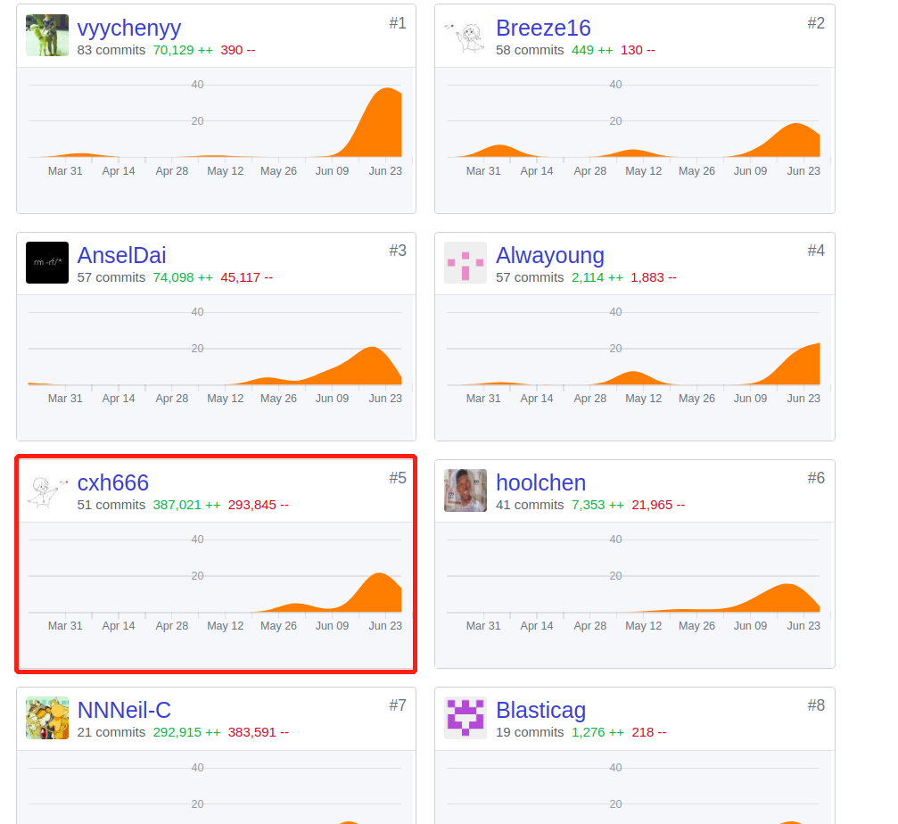

# 系统分析与设计项目个人小结

## 个人简短小结

在这次项目开发的过程中，我主要担任项目后端的数据库搭建和后端开发。

1. 项目启动会议之后，学习基础的flask后端开发及后端开发框架。然后搭建了简单了注册登入登出系统并在本地成功测试。
2. 学习了如何将项目部署到新浪云容器，搭建需要的部署环境，并成功部署。
3. 数据库添加了任务类和接受者状态类，并在第二次会议中统一了各个类的属性，并部分确定需要哪些api接口以及接口数据格式。
4. 编写utils工具函数便于管理和编程。并在组员的工作的基础上，继续优化api。最后完善所有api设计，包括钱包相关的充值提现和查看钱包状态、图片相关的上传头像更改头像和上传任务图片修改任务图片、修改用户信息、更改密码、查询相关的查询已发布任务、查询已接受任务、任务广场的推荐、根据任务类型搜索等。然后编写测试文件进行测试成功运行。
5. 最后与前端工程师进行接口对接和测试，并成功部署在服务器上并成功运行。然后补充后端相关文档。

项目的过程中学习到了很多的东西，除了技术上的学习，还了解到一个项目从产品到开发到测试到发布整个过程的主要步骤。学习到了前后端数据的沟通的重要性，更了解了敏捷开发的实用性和效率，也了解了产品组在确定需求以及设计的好坏，都很容易影响到开发，所以对整个项目的开发的流程有了更深的了解，以及对各个阶段的关键点有了概览。

## PSP2.1统计

|                                       |     Personal Software Process Stages     | Time(%) |
| ------------------------------------- | :--------------------------------------: | :-----: |
| **Planning**                          |                 **计划**                 | **10**  |
| estimate                              |               预估任务时间               |   10    |
| **Development**                       |                 **开发**                 | **80**  |
| analysis                              |                 需求分析                 |    2    |
| design spec                           |               生成设计文档               |    2    |
| estimate                              |                 设计复审                 |    2    |
| coding standard                       |                 代码规范                 |    2    |
| design                                |    具体设计，包括绘制 UI，设计架构等     |   25    |
| coding                                |                 具体编码                 |   32    |
| code review                           |                 代码复审                 |    5    |
| test                                  |             测试（修改代码）             |   15    |
| **Report**                            |                 **报告**                 | **10**  |
| test report                           |                 测试报告                 |    1    |
| size measurement                      |                计算工作量                |    1    |
| postmortem & process improvement plan | 每次迭代结束后写总结文档，并提出改进计划 |    3    |

## 主要工作清单

在开发的过程中，印象最深的两次，一次就是小程序开发上与web开发的不同导致的问题，一次是flask_sqlalchemy不完善导致的问题。

第一次是因为没有cookies所以没有办法实现会话保存，一开始不知道导致不知道bug的来源。最后实现一个简单的会话验证解决问题。

第二次是sqlite中的PickleType类型的使用，这个类型的库不是很完善，导致提交不进去数据库，最终使用其他方法，将原来的删除并新建解决问题。

## 在项目相关仓库中的贡献，仅需要截图

## 个人博客清单

汇总：[个人技术博客](https://github.com/cxh666/MakeMoney/tree/master/Tech Report)

1. [个人技术报告之SQLAlchemy学习.md](https://github.com/cxh666/MakeMoney/blob/master/Tech Report/个人技术报告之SQLAlchemy学习.md)

2. [个人技术报告之SQLAlchemy错误及经验.md](https://github.com/cxh666/MakeMoney/blob/master/Tech Report/个人技术报告之SQLAlchemy错误及经验.md)

3. [个人技术报告之flask+gunicor+supervise+nginx经典后端框架部署.md](https://github.com/cxh666/MakeMoney/blob/master/Tech Report/个人技术报告之flask%2Bgunicor%2Bsupervise%2Bnginx经典后端框架部署.md)
4. [个人技术报告之flask及云服务器部署错误及经验.md](https://github.com/cxh666/MakeMoney/blob/master/Tech Report/个人技术报告之flask及云服务器部署错误及经验.md)
5. [个人技术报告之flask学习.md](https://github.com/cxh666/MakeMoney/blob/master/Tech Report/个人技术报告之flask学习.md)
6. [个人技术报告之小程序后端的不同.md](https://github.com/cxh666/MakeMoney/blob/master/Tech Report/个人技术报告之小程序后端的不同.md)

# 特别致谢

首先特别感谢@[NNNeil-C](https://github.com/NNNeil-C)的合作以及前端@[AnselDai](https://github.com/AnselDai)和@[hoolchen](https://github.com/hoolchen)对后端的建议，感谢产品组@[vyychenyy](https://github.com/vyychenyy)、[Breeze16](https://github.com/Breeze16)和[Alwayoung](https://github.com/Alwayoung)对产品需求的准确分析和设计以及对项目文档的编写，感谢所有队员的合作才能完成这个项目！
